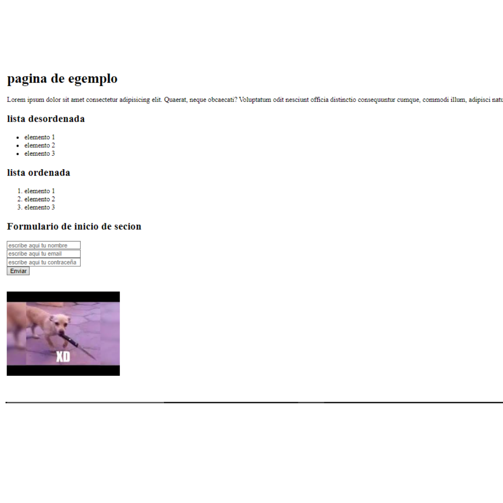

# *C*onsignas ***HTML***

1. *crear una pagina con un titulo y un parrafo*.

2. *incluir una imagen en un pagina la cual deve tener una descripcion en caso de que la imagen no pueda ser mostrada*.

3. *crear una lista no ordenada con almenos 3 elementos y una lista ordenada con almenos 3 eleemntos tambien*.

4. *crear un formulario este deve tener los siguientes campos*.
    * campo de nombres
  
    * campo de email

    * campo de contraceña

    * un boton de enviar

* (estos todavia no haran nada puesto a que eso es mucho mas avanzado).

5. *tu pagina debe tener un enlace con una pequeña descripcion para saber a que pagina te lleva*.

### Ejemplo final  

